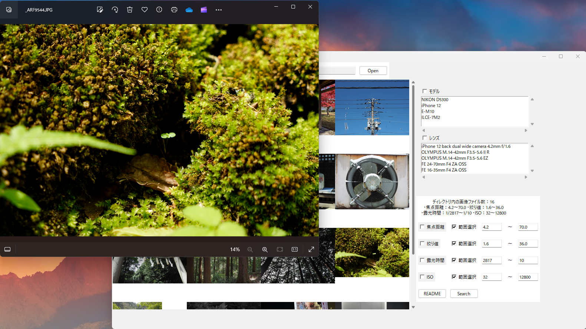

<h1 align="center"></h1>

## Description

You can use ExifExplore to search for images in a folder that match a specified focal length, f value, etc.

Japanese version of README.md can be found in [./docs/ja/README.md](./docs/ja/README.md).

## Features

ExifExplore is a graphical tool that performs a conditional search of image files in a folder based on Exif information.
Only image files with .jpg or .png extension are accepted.
You can check the checkbox for the parameter you want to use and specify its numerical value, or specify a range of two numerical values.

You can search for image files in a folder by specifying the following items:

- camera model
- lens model
- focal length
- f-number
- exposure time
- ISO

You can also click on any of the listed images to view the image in the Photos application.



## System requipments

- Windows 10 64-bit or later

(We have not confirmed execution on environments other than those listed above, such as MacOS, so please do so at your own risk.)

## Development Enviroment

Python environment and libraries used are listed below.

- Python 3.8 or later
- tkinter
- PIL

## How to build standalone executable

You can easily build a standalone executable by using pyinstaller:

```bash
# install pyinstaller (if Anaconda, you should use conda.)
pip install pyinstaller
# build by using pyinstaller
pyinstaller exif_explore.py --onefile --noconsole --exclude pandas --exclude numpy
```

### postscript

For listing images using tkinter, I refer to the article URL: [https://qiita.com/takimotoseiji/items/a70ae15e1d8dbd858d5c](https://qiita.com/takimotoseiji/items/a70ae15e1d8dbd858d5c).
ExifExplore currently available is an initial version.
Please contact me for any problems or improvements.
I plan to add or implement additional functions as needed...
