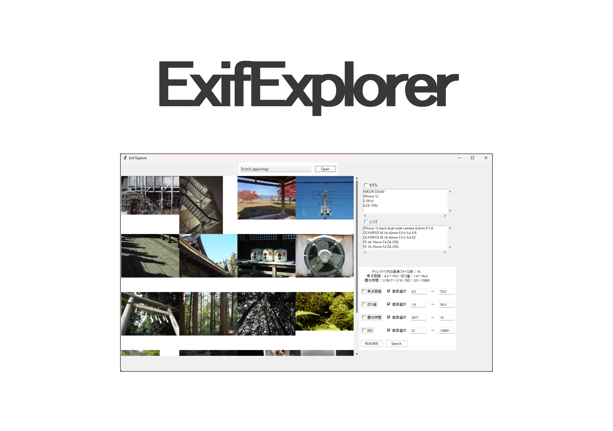

<h1 align="center"></h1>

## 説明

ExifExplorerを使用することで、指定した焦点距離やf値などに一致するフォルダ内の画像を検索することができます。

## 特徴

ExifExplorerは、Exif情報を基に、フォルダ内の画像ファイルを条件検索するグラフィカルなツールです。
使用するパラメータのチェックボックスにチェックを入れ、その数値を指定、もしくは2つの数値で範囲指定することができます。
拡張子が .jpg または .tiff の画像ファイルにのみ対応しています。

以下の項目を指定して、フォルダ内の画像ファイルを検索できます：

- カメラモデル名
- レンズモデル名
- 焦点距離
- f値
- 露光時間
- ISO

また、一覧表示されている画像をクリックすることで、フォトアプリで画像を確認することができます。


## 動作環境

- Windows 10 64-bit 以降

(MacOSをはじめ、上記以外の環境での動作は確認していません。動作は自己責任でお願いします。)

## 開発環境

使用した言語とライブラリは、以下の通りです。

- Python 3.8 or later
- tkinter
- PIL

## スタンドアロンの実行可能ファイルをビルドする方法

pyinstallerを使用することで、簡単にexe化することができます:

```bash
# install pyinstaller (if Anaconda, you should use conda.)
pip install pyinstaller
# build by using pyinstaller
pyinstaller exif_explorer.py --onefile --noconsole --exclude pandas --exclude numpy
```

### postscript

tkinterを使用した画像の一覧表示には、URL: [https://qiita.com/takimotoseiji/items/a70ae15e1d8dbd858d5c](https://qiita.com/takimotoseiji/items/a70ae15e1d8dbd858d5c)の記事を参考にさせていただきました。
現在公開中のExifExplorerは、初期バージョンです。
何か問題点や改善点がありましたら、お問い合わせください。
随時、機能の追加や実装を行う予定です...
